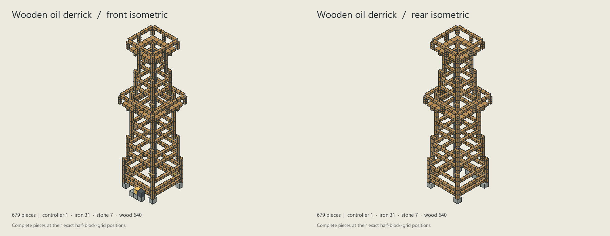
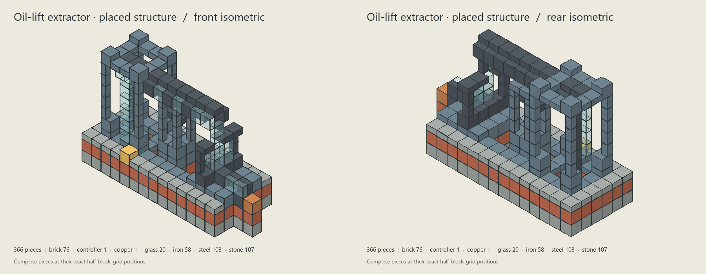
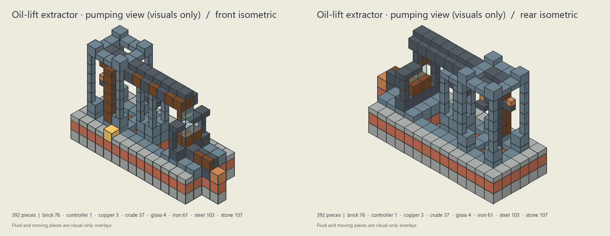
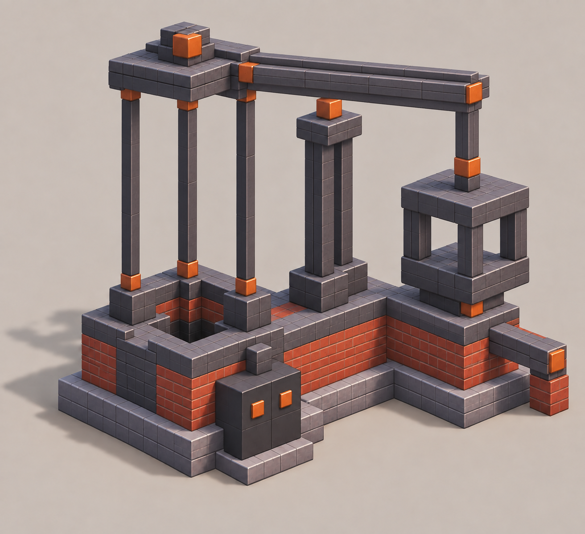
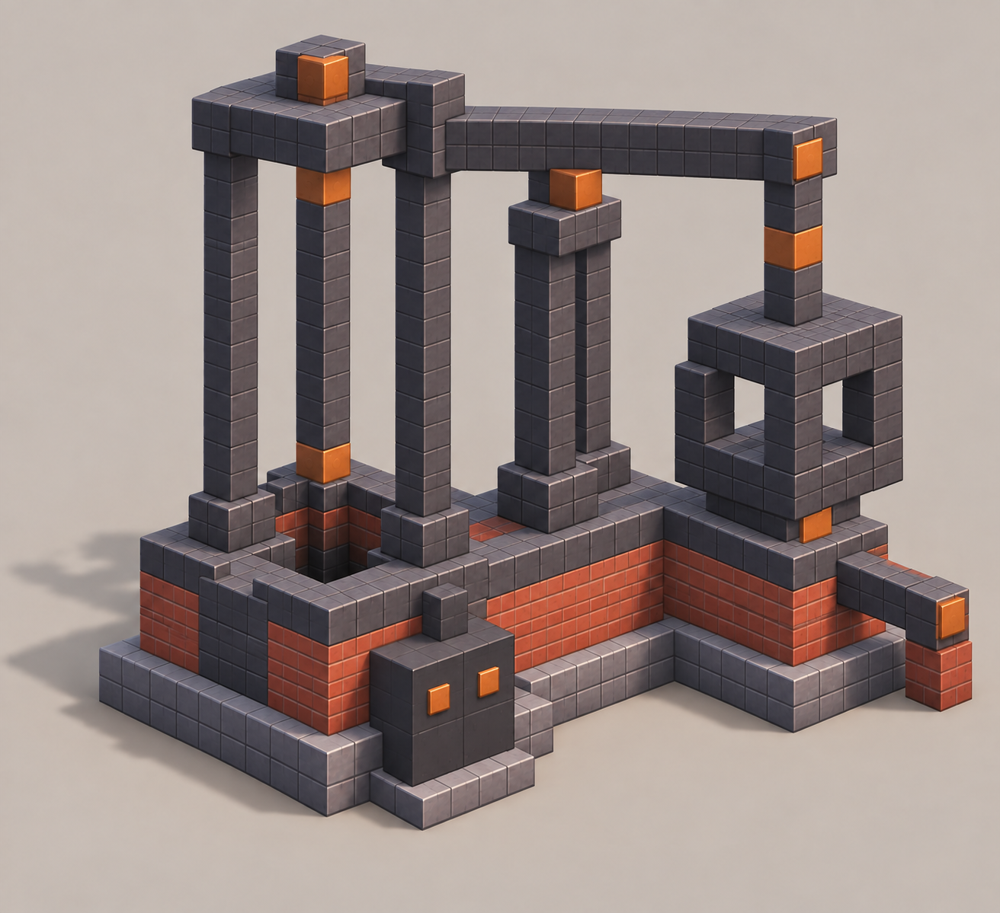
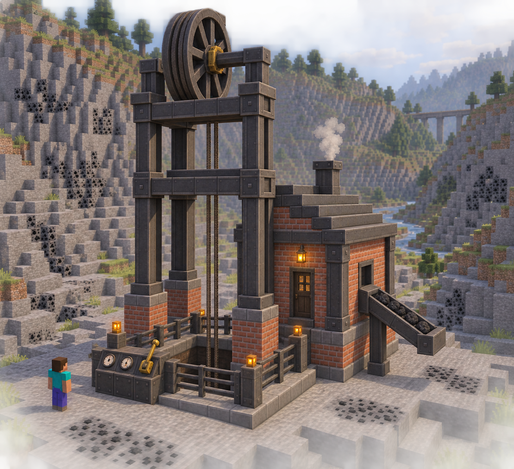
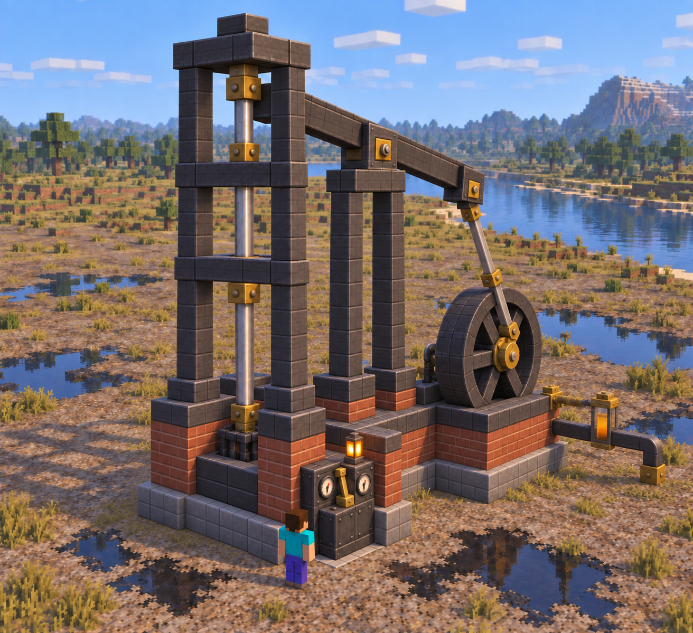
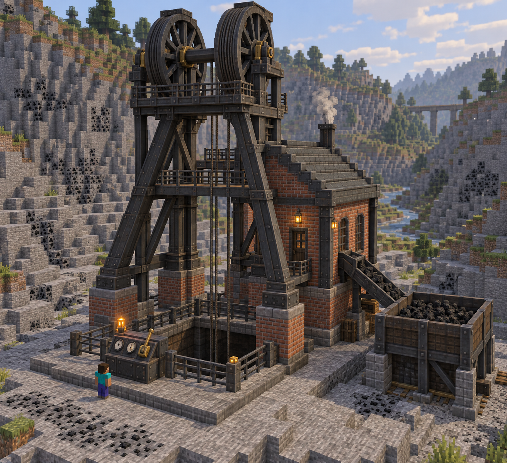
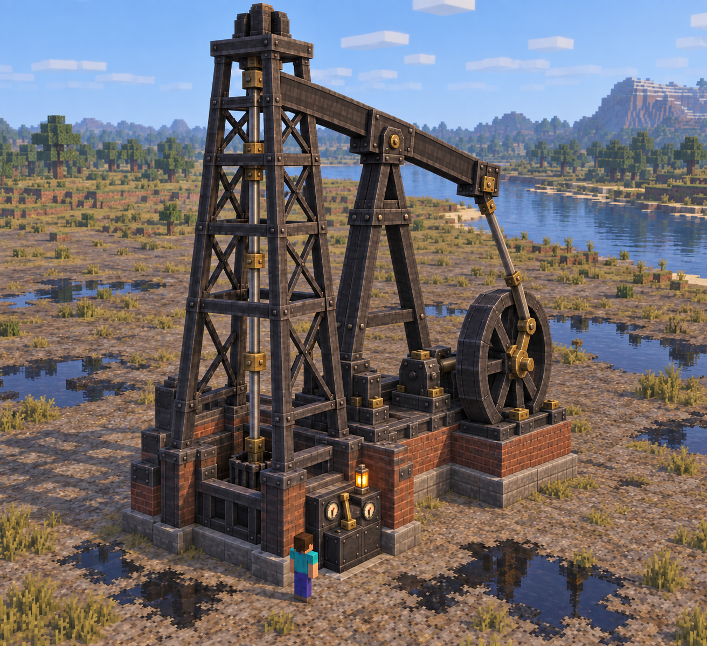

# Coal and oil extraction siege concepts

## Wooden oil derrick — 2026-09-28



The former Oil Pump is now a late-nineteenth-century wooden Oil Derrick. Its [coordinate layout](oil_derrick_plan.py) and [half-block construction layers](oil_derrick_plan/layers.png) use only full blocks, half slabs, quarter beams, and eighth cubes for the fixed structure. One extra five-block structural bay gives the tower a slender 32.5-block (107-foot) height to the top rail, above the common 75-foot historical reference as a deliberate silhouette choice. Four tapered open legs rise from an 8×8 stone-footed base around a central well and iron drill string. Two horizontal timber ties per five-block bay give the tall frame a denser braced silhouette. A reachable controller and crude outlet sit at ground level outside the front frame. The 8×8 middle gallery sits near the midpoint; the narrower 6×6 crown gallery remains at the top. Both are **one-block-wide walking rings**: each projects one block beyond the legs at its own height, with an open center instead of a broad solid deck. Short timber outriggers support their overhangs. Upright posts and handrails sit **outside** each walking ring, leaving the full block-wide path clear. The stepped posts are intentional half-grid construction rather than unbuildable diagonal timbers.

The drawing has **679 non-overlapping placed pieces** and passed the isometric planner's half-block-grid validation. [The exporter](../../tools/modeling/export_oil_derrick.py) turns 678 pieces after the controller into the [runtime pattern](../../civilization-mod/src/main/java/dev/civilization/OilDerrickStructure.java). The fixed central string and small animated crosshead are visual; physical oil depletion, extraction throughput and the existing output buffer remain unchanged. The Photon/Faithful front and rear views were reviewed in a disposable test world. Construction cost and high-player-count performance have not yet been balanced.

Rebuild the views from the repository root:

```powershell
python tools/modeling/isometric_plan.py concept_art/extraction_sieges/oil_derrick_plan.py concept_art/extraction_sieges/oil_derrick_plan
```

The earlier images were generated on 2026-09-26; the later oil plans are exact offline drawings made with the isometric script. The oil-lift layout below is retired history; earlier drafts and the coal concept remain studies, and no siege rule is implemented. The agreed gameplay direction is in [design direction](../../design_direction.md#4-regional-land-and-materials); remaining decisions are in [open decisions](../../open_decisions.md#extraction-installation-sieges).

Both machines are landmark-scale industrial objectives. Their ground-level control stations should be physically reachable, while players build the perimeter, walls, gates, roads and supply lines themselves. Preserve the physical coal-block removal and falling oil level. Draw from the existing [industrial steel family](../../art/assets/industrial_steel/asset.json), [Oil Engine](../../art/assets/oil_engine/asset.json), and late-nineteenth-century material palette. The revised direction uses mostly ordinary blocks, the existing saw-cut half slabs, quarter beams and eighth cubes on their 2×2×2 grid, and only a small number of custom moving parts, controllers and ports. Existing ports, throughput and progression are implementation constraints to resolve during design, not silently discarded.

## Current simplified direction

These edits retain the approved silhouettes while reducing the number of special shapes. Sizes are visual targets, not final structure definitions or material counts.

| Installation | Ordinary and saw-cut construction | Limited custom parts |
| --- | --- | --- |
| Coal headframe | Brick or stone footings; straight iron/steel posts and crossbeams; half-slab caps; simple 2×2 open shaft; small brick motor shed; short block-built coal chute | One hoist wheel with cable, controller, existing fuel/oil and coal output interfaces |
| Oil extractor | Brick footings and bed; square vertical posts, quarter-beam or slab crossbars; open well; no fixed diagonal trusses | One animated beam/flywheel/crank/rod assembly, controller and crude outlet |

The first generated simplified oil image retained sloping fixed supports that the half-grid pieces cannot reproduce cleanly. Its edit replaces them with vertical square supports. The moving beam and linkage can still angle during animation. For both machines, omit tiny railings, ornamental fasteners, scenery and attached storage from the required multiblock. Only the built structure should appear in the guide; players may add their own surrounding architecture.

### Oil construction review

The simplified oil painting is a historical visual direction only. The SVG blockout and its 79-piece draft were discarded because their incomplete-looking rendering could not establish the machine's real geometry. The [implemented oil-lift plan](#oil-lift-extractor-isometric-study--2026-09-26) and [earlier four-piece study](#four-piece-oil-geometry-study--2026-09-26) use the [isometric block-plan script](../../tools/modeling/README.md#isometric-block-plans). Planning did not require Blockbench or Minecraft; the final layout was exported to a runtime structure and checked in-game.

### Oil-lift extractor isometric study — 2026-09-26





This iteration was drawn **directly from the coordinate plan**, without another generated mockup. It changes the meaning of the [prior static beam and square frame](oil_block_plan_v2/isometric-sheet.png). The open well and tall partial-block tower now guide a small reciprocating plunger; a glass-fronted riser climbs beside it; the former beam is a fixed boxed crude header with spaced viewing windows; the far square frame is a glass-fronted output chamber; the lower duct reaches a pipe port. From the front, a player can follow well → riser → header → chamber → outlet. The rear view verifies the same structure from the opposite side. Dark amber in the operating view denotes visible crude, not a new construction material or a new fluid mechanic.

The [placed-structure source](oil_block_plan_v3.py) has **366 placed pieces: 196 full blocks, 116 slabs, 50 quarter beams and 4 eighth cubes**. The runtime pattern also required 22 open air cells in the well and replaced the drawn terminal with a real Refinery Port. Stone and brick formed the bed; full steel feet took tower loads; quarter beams formed the tall posts and middle supports; slabs built the collars, header sides and chamber window. Its [construction layers](oil_block_plan_v3/layers.png) give exact half-block positions. A former exporter translated that study into a runtime structure; the current exporter and structure now use the wooden derrick plan above. The separate [operating view](oil_block_plan_v3_operating.py) added visual-only crude and moving plunger/crosshead pieces; its state-layer image was **not** a construction list. A disposable non-shader industry scene verified the old assembly's front, rear and guide; its Photon review did not complete before retirement.

The intended runtime feedback would use the existing physical oil-height extraction and 4,000 mB pump output buffer: a completed 125 mB step advances the visible crude pulse, while the chamber displays the current buffer level. Empty/disconnected flow windows clear; a full output chamber remains visibly full and the plunger pauses. Only the small plunger/crosshead and fluid surfaces would animate. The large built structure stays static, avoiding an animated assembly of player-placed blocks. These are proposed presentation rules, **not shipped behavior**; a native model and in-game review remain before adoption.

Rebuild both views from the repository root:

```powershell
python tools/modeling/isometric_plan.py concept_art/extraction_sieges/oil_block_plan_v3.py concept_art/extraction_sieges/oil_block_plan_v3
python tools/modeling/isometric_plan.py concept_art/extraction_sieges/oil_block_plan_v3_operating.py concept_art/extraction_sieges/oil_block_plan_v3_operating
```

### Four-piece oil geometry study — 2026-09-26



The [revised coordinate plan](oil_block_plan_v2.py) is the current proposal. Its [front and rear isometric views](oil_block_plan_v2/isometric-sheet.png) and [half-block construction layers](oil_block_plan_v2/layers.png) show the actual pieces, rather than relying on the generated illustration. This keeps the masonry foundation and full-block load feet but uses quarter beams for the four tall uprights and middle bent, slabs for the well and roof collars and bearing deck, a half-height main beam with paired quarter-beam edge ribs, and an open counterweight frame with slim sides. Eighth-cube copper pieces mark a few bearing junctions. The 347-piece study contains **195 full blocks, 75 slabs, 65 quarter beams and 12 eighth cubes**. Both isometric views were inspected; the grid and overlap validation passed. The middle deck was moved to the upper half-cell so it physically meets the beam. The generated image still suggests a few painted connections; the coordinate plan governs buildable geometry.

The current illustration is a referenced edit of [the earlier concept](oil-block-concept-v2.png), made with the built-in image-generation tool. Source `C:/Users/admin/.codex/generated_images/01a08a58-4280-7292-9a4b-a14f940d3cfc/exec-fc7dd4ae-fba8-47af-86c1-6fe0e8789743.png`, SHA-256 `8098537cdefc5d9aead44969e2565a19814bb051180ac2012e955fde061a6fc0`. Its shape now makes the cut pieces visibly structural while retaining a sturdy pump silhouette. The visual and coordinate plan are still **concepts**, not approved multiblock construction, an animated mechanism, or a shipped machine.

Rebuild the revised drawings from the repository root:

```powershell
python tools/modeling/isometric_plan.py concept_art/extraction_sieges/oil_block_plan_v2.py concept_art/extraction_sieges/oil_block_plan_v2
```

Exact revised image prompt (input: [earlier concept](oil-block-concept-v2.png)):

```text
Edit this SAME isometric block-built oil extractor, preserving the exact overall composition: left open-well tower, low brick machine bed, central support, long level beam, right hollow square counterweight frame, front cabinet, short output, plain background and camera. Improve its construction by making real structural use of Minecraft's saw-cut pieces, never inventing any other geometry. Only allowed pieces: full 1x1x1 block; slab 1x1x0.5 in any axis; quarter beam 1x0.5x0.5 in any axis; eighth cube 0.5x0.5x0.5. Turn the four upper tower uprights ABOVE sturdy full-block feet into visibly slimmer vertical quarter-beam columns at the tower's outer corners (each still meets the foot and roof). Make roof and well collars from half-slab bands with readable half-block thickness and squared corners. Replace the fat long top beam with a strong but lighter 0.5-block-thick slab core and parallel quarter-beam edge ribs; it remains perfectly level and contacts the central bearing and right connector. Rebuild the right square frame with a broad full-block lower footing but half-slab sides and quarter-beam inner edges, leaving a genuinely open square window. Use a few eighth-cube copper bearing keys exactly where beams join supports, visibly 0.5-block cubes, not tiny decorative bolts. All pieces are axis-aligned on the half-block grid, solid rectangular prisms and physically touching their supports. Preserve the machine's industrial strength and readable pump architecture; do not turn it into lacy ornament. No cylinders, curves, diagonal members, round knobs, plates thinner than 0.5, or texture-only fake structures. Clear seams and different thicknesses so a builder can identify the four piece sizes by sight. One clean isometric view, no text.
```

#### Earlier, bulkier iteration



This new concept deliberately restricts **all geometry** to full blocks, 1×1×½ slabs, 1×½×½ quarter beams and ½×½×½ eighth cubes on the half-block grid. The first generation had a sloped beam, round knobs and a small lantern; the targeted edit removed those. The final image retains a low brick bed, an open well under a tall four-post headframe, a level crossbeam, a middle support, a hollow square counterweight frame, a front controller and a short output channel. Copper face marks are surface decoration, not smaller required parts. Generated with the built-in image tool; source `C:/Users/admin/.codex/generated_images/01a08a58-4280-7292-9a4b-a14f940d3cfc/exec-9b37c16f-18b1-4324-926a-36137f65d481.png`, SHA-256 `76b1439eaa3cd6533f25fc110b8c164499f98b868e064788b1c702986587c01e`. The [first image](oil-block-concept-first.png) is retained as the rejected iteration; source `C:/Users/admin/.codex/generated_images/01a08a58-4280-7292-9a4b-a14f940d3cfc/exec-85c0672f-6a0c-4d04-9e94-f88788c2ddff.png`, SHA-256 `693883ff74b4767215ffae5dddc82938162fb8be21a6787ea932bf66124b9422`.

The [first block-placement source](oil_block_plan_v1.py) turns those major shapes into a reproducible 16×6×10½-block study. Its [two isometric views](oil_block_plan_v1/isometric-sheet.png) show the complete pieces; the [construction layers](oil_block_plan_v1/layers.png) specify exact half-block cells. The first plan has 266 full blocks, 41 slabs, 15 quarter beams and 4 eighth cubes (326 pieces total). It used partial blocks mostly as trim, prompting the revision above. The large footprint, material costs, moving behavior, deposit alignment, ports and siege-control interface still need design review before implementation. Do not treat either concept study as an approved multiblock or a working animated pump.

Rebuild its drawings from the repository root:

```powershell
python tools/modeling/isometric_plan.py concept_art/extraction_sieges/oil_block_plan_v1.py concept_art/extraction_sieges/oil_block_plan_v1
```

Exact first-generation prompt (the earlier [simplified oil painting](oil-extractor-simplified.png) was a **material/mood reference**, not a geometry target):

```text
Use case: stylized-concept. Create a NEW clean isometric concept image for Civilization's large oil-extraction multiblock, using the attached picture only as a reference for its late-1800s industrial brick-and-dark-iron material mood and the idea of a monumental pump over a well. Redesign the geometry from scratch under a strict Minecraft construction rule: EVERY visible piece of the machine must be an axis-aligned rectangular prism on a 2x2x2 half-block grid, and ONLY four piece sizes may appear: full block 1x1x1; half slab 1x1x0.5 in any axis; quarter beam 1x0.5x0.5 in any axis; eighth cube 0.5x0.5x0.5. No angled, curved, cylindrical, diagonal, round, wedge, stair, fence, plate or custom-shaped parts whatsoever. Do not draw any shaft rod, pipe, spoked wheel, cable, gear or gauge that violates the block-size rule. The machine should still read unmistakably as a serious pump installation through architecture: a broad low brick-and-stone machine bed around a dark 2x2 open well; four tall iron block posts; a heavy square overhead crosshead and long horizontal block-built walking beam; a large open square block-built counterweight frame at the opposite end, constructed from full blocks and quarter beams; one accessible ground-level block control cabinet at the front and one short square block output channel at the side. Approximate build envelope 9 blocks wide x 11 deep x 9 high. Clear negative space, robust supports touching the foundation, no floating parts. Make its proportions impressive but easy to count and recreate as a multiblock. Show one large three-quarter isometric view of the whole machine on a plain neutral ground with subtle shadow and a clear uncluttered background. Emphasize visible Minecraft block boundaries and coherent full cuboids, not painterly ambiguity. Restrained brick, stone, cast iron, steel, tiny purposeful copper accents. No scenery, people, text, annotations, inset views, fake fine mechanical detail, or decorative clutter.
```

Exact targeted edit prompt (input: [first image](oil-block-concept-first.png)):

```text
Edit this exact oil-extraction multiblock concept, preserving its overall wide low brick foundation, open square well on the left, tall four-post iron tower, central support, large hollow square counterweight frame on the right, front controller location, plain background, camera and material palette. Fix ONLY mechanical/buildability violations: replace the long descending diagonal walking beam with a perfectly HORIZONTAL axis-aligned straight rectangular beam assembled from whole 1x1x1 blocks and 1x0.5x0.5 quarter beams at a single level. Use a short VERTICAL block column at its right end to reach the lower square counterweight frame if needed. All supports must meet full blocks directly and be grounded. Remove all round bolts, round knobs, cylinders, lanterns, tiny plates, inset sticks and sub-half-block details; any copper detail must be a full block, slab 1x1x0.5, quarter beam 1x0.5x0.5 or eighth cube 0.5x0.5x0.5. The entire machine must be built exclusively from these four axis-aligned Minecraft block sizes on a 0.5-block grid, with clear block seams, no slopes, curves, circles, diagonals or custom-shaped parts. Make the controller a single dark full block with flat square accent pixels on its face, not protruding controls. Keep the image simple and clearly constructible. One isometric view, no annotations or scenery.
```

### Simplified coal headframe



Built-in image generation, referenced edit of [the first coal concept](coal-headframe.png). Source: `C:/Users/admin/.codex/generated_images/01a08a58-4280-7292-9a4b-a14f940d3cfc/exec-12d30140-ee57-4626-b909-97a7e20ef118.png`. SHA-256 `e45cc3f12fead5cb574e8c41b2f088a0361beb2328f08f327036091a1fefb8de`. Review: simplified square frame and single wheel read well at distance. The pictured fence, lights and stepped roof remain optional/not required. A native blockout must verify the wheel fits its beam supports and the shaft matches the real coal site.

Exact edit prompt (input: first coal concept above):

```text
Revise this SAME Civilization Minecraft coal extraction machine design into a practical, SIMPLIFIED multiblock construction concept while preserving its recognizable mine headframe, mine opening, coal output direction, brick/iron palette and accessible ground-level control cabinet. Most visible structure must be assembled from ordinary Minecraft 1x1x1 blocks plus the mod's saw-cut half slabs (1x1x0.5), quarter beams (1x0.5x0.5), and eighth cubes (0.5x0.5x0.5). All pieces sit on the exact Minecraft half-block grid. Make a compact but impressive approx 7x7-block footprint and 9-11-block height: four strong vertical posts from full blocks and quarter-beam edge trim; two or three full-block crossbeam levels; half-slab caps and braces made of perpendicular beams, no diagonal steel trusses. A single large simple grooved hoist wheel at the top is the ONLY custom-shaped animated piece, with a straight cable descending into a square 2x2 central shaft. At one side, a plain 3x3 brick-and-steel motor shed with uncomplicated block roof. A short square coal chute exits to the right but NO attached giant storage bunker. Reuse block textures like existing industrial steel and brick; avoid microdetail, rivet spam, ornate cornices, tiny custom rails, ladders and pipes. Ground-level siege control cabinet uses one custom controller block on the FRONT, with lever, two gauges and amber light, clearly reachable by a player. Keep the visual impact from height and one wheel, not complexity. Show a clean three-quarter view with one Minecraft player for scale, block edges and half-block grid visibly clear, context terrain but no player fortifications, no text, no labels, no collage. Make it actually feasible to build with a transparent multiblock guide.
```

### Simplified oil extractor



Built-in image generation, referenced edit of [the first oil concept](oil-extractor.png), then a targeted support correction. Initial simplified source: `C:/Users/admin/.codex/generated_images/01a08a58-4280-7292-9a4b-a14f940d3cfc/exec-4269fbb4-e61c-4cfe-8aca-e476fe564d8a.png`, preserved as [first simplified iteration](oil-extractor-simplified-first.png), SHA-256 `3df5d5c291063f639bebd35b5f26ad8cbf0161e65c29d0f159d5281d242a6d18`. Final source: `C:/Users/admin/.codex/generated_images/01a08a58-4280-7292-9a4b-a14f940d3cfc/exec-5c513c58-63b4-4345-b466-f6bf89e06dc2.png`. Final SHA-256 `19cbc4d9464fab05aa30c8ea8160f2c40c8537412f5d15c5836ffa9b57bc9d35`. Review: static construction now largely maps to full and cut blocks; the wheel, crank, beam and rods still need pivot/clearance proof. The image shows materials and massing, not an exact cut-piece placement guide.

Exact first edit prompt (input: first oil concept above):

```text
Revise this SAME Civilization Minecraft oil extraction machine design into a practical, SIMPLIFIED multiblock construction concept while preserving its distinctive tall well frame, grounded flywheel-to-beam pump linkage, crude outlet and accessible front control cabinet. Most visible structure must be assembled from ordinary Minecraft 1x1x1 blocks plus the mod's saw-cut half slabs (1x1x0.5), quarter beams (1x0.5x0.5), and eighth cubes (0.5x0.5x0.5), all aligned to the exact half-block grid. Make a manageable approximately 7x9-block footprint and 9-11-block height. Well frame: four robust straight iron posts on brick footings, 2-3 horizontal beam courses and a simple square top, NO diagonal X braces. Pump: a thick block-built walking beam using quarter-beam and slab modules, pivoted on two grounded block-built A-frame-like supports; one end reaches the vertical well rod, the other visibly connects via one plain diagonal pitman bar to an off-center crank pin on ONE custom-shaped flywheel. Those wheel/crank/pitman/vertical rod mechanisms can be specialized moving parts; every platform, support, casing and frame is ordinary/cut blocks. A short sturdy pipe exits from the right side, with one simple sight glass. A single custom controller block faces forward at ground level with lever, two gauges, amber lamp, unobstructed for attackers to reach. No extra buildings, no defensive walls, no railings, no ornate fittings or tiny decorative plates; Minecraft block edges and repeated components obvious. Iron, fired brick and restrained brass only. Use the same clear three-quarter camera and one Minecraft player for scale, no labels, no text, no collage. It should look like a satisfying multiblock players could actually assemble with the mod's transparent placement guide, impressive from silhouette and motion rather than enormous part count.
```

Exact correction prompt (input: first simplified oil iteration):

```text
Edit ONLY the fixed support geometry in this exact simplified Minecraft oil extractor concept. Preserve camera, player, color/materials, brick base, front controller, outlet pipe, vertical well rod, moving walking beam, pitman rod, and single flywheel. The four tall well-frame posts and the beam's pivot support must be buildable solely from Minecraft full blocks, horizontal/vertical HALF SLABS, QUARTER BEAMS, and EIGHTH CUBES on an exact 0.5-block grid. Replace any smooth diagonally sloping or tapering stationary posts with truly vertical square-edged posts and square horizontal crossbeams. Replace the dark A-shaped beam pivot stand with a grounded pair of straight vertical columns and a short horizontal slab lintel carrying the pivot. The walking beam itself can remain angled because it is a single animated custom part; its diagonal pitman also remains a custom moving part. Simplify fixed bases into ordinary brick full blocks and steel slabs/quarter beams; no other ornamental additions. Maintain the same strong silhouette and readable reachable control station. No labels, no text, no collage.
```

## Coal headframe



Source: `C:/Users/admin/.codex/generated_images/01a08a58-4280-7292-9a4b-a14f940d3cfc/exec-9aa969ba-a9e1-4e32-b27f-4cb691697b8b.png`. SHA-256 `2be8da548a36cbb00b53347ba12d6787a70eca78c5683ca2d5d198581e2c9f5a`.

Silhouette: headframe, paired hoist wheels, visible shaft, brick winding house and short coal chute. The amber-lit front control cabinet is the intended siege endpoint. Visual review: the machine reads clearly at a distance; the braced iron frame and brick foundations carry the apparent loads. Before implementation, align the hoist/shaft with generated seam geometry and decide whether a player-excavated opening is required. The image's many surface coal-ore specks are scenery, not a new deposit rule. The small railings and attached bunker are illustrative, not required parts.

Exact generation prompt:

```text
Create ONE detailed concept-art mockup of a large, player-buildable COAL EXTRACTION MACHINE for a Minecraft alternate-history civilization MMO, seen in a clear 3/4 elevated view, in a natural rocky coal valley. The machine is the entire strategic siege objective, NOT a fortress: a substantial late-1800s mine headframe and mechanical hoist built over a dark vertical mineshaft, approximately 9x9 Minecraft blocks in footprint and 12-15 blocks tall, with two exposed large grooved winding wheels on a shared shaft, believable cable running straight downward into the shaft, a grounded iron-and-brick hoist house, coal coming out via a short inclined chute into an open coal bunker. At ground level in the FRONT, a clearly reachable operator control station integrated into the machine: a waist-high dark enamel panel with one large brass lever, two simple readable gauges, and a strong distinctive amber lamp; this is the physical point an attacker must reach. Functional machinery, believable bearings and supports, no floating parts, no decorative gears, no random tubes. Do NOT add perimeter walls, defensive towers or soldiers: player-built defenses should surround the installation later. Include one tiny Minecraft player beside it as scale reference and an open approach at the front. Material palette consistent with Civilization mod: rough brick foundation, dark cast iron and steel, restrained brass only for bearings/instruments, worn but not noisy texture, readable 32-pixel-per-block material feel. A coherent Tesla-lifetime late nineteenth-century industrial aesthetic, grounded and substantial, not fantasy steampunk. Render as a polished Blockbench-feasible Minecraft blocky model concept using cubic and simple octagonal forms, not photorealism, no labels or text, no inset panels, no collage. The overall composition should make the whole machine and its control point legible.
```

## Oil extractor



First source: `C:/Users/admin/.codex/generated_images/01a08a58-4280-7292-9a4b-a14f940d3cfc/exec-d2796016-4f5b-42e3-a5ab-3eb6dfb1d088.png`, preserved as [first iteration](oil-extractor-first.png), SHA-256 `c39f80bc6d5c6a0e1dfbb38790728a1ffc7920f1f9effa834fc42633e0cf3d25`. Final source: `C:/Users/admin/.codex/generated_images/01a08a58-4280-7292-9a4b-a14f940d3cfc/exec-5eed2fc4-b5f9-4ba0-9ab4-e95a663eac36.png`. Final SHA-256 `5a40c1c5d18c7d9639f4a867e3f77b034f880dc45b82c77db9120f0bf717b925`.

Silhouette: open derrick, well rod, pivoted beam and large flywheel, with a low crude outlet and the same reachable control-cabinet language. Visual review: the first mockup disconnected the beam from the drive; the referenced edit adds a grounded beam pivot and flywheel linkage. The final image is a useful shape target, but its derrick/beam pairing and exact kinematics need a Blockbench blockout and animation clearance review before implementation. The scenery puddles are not a terrain or fluid rule. Do not let the machine's own railings or fencing become a prefab fortification.

Exact initial generation prompt:

```text
Create ONE detailed concept-art mockup of a large, player-buildable OIL EXTRACTION MACHINE for a Minecraft alternate-history civilization MMO, seen in a clear 3/4 elevated view on a lonely flat oil field near a river. It is the entire strategic siege objective, NOT a fortress. The machine has a distinctive circa-1900 oilfield silhouette: a tall but compact open steel drilling derrick over a clearly visible well opening, approximately 9x9 Minecraft blocks in footprint and 13-16 blocks tall, with a believable centered vertical drill/pump rod, a ground-level reciprocating walking beam and large heavy flywheel on a solid brick-and-iron motor base to one side; coherent rigid linkages from flywheel crank to beam, anchored supports, no impossible mechanisms. A stout crude pipe leaves from a low side outlet; a modest open gauge/sight-glass shows dark amber crude. At ground level in the FRONT, integrated into the derrick base, is a clearly reachable operator control station: waist-high dark enamel panel, one large brass lever, two simple pressure gauges, and a distinctive amber lamp; this is the physical point an attacker must reach. Preserve open access in front, space around for players to build their own defenses later; no perimeter wall, no defensive towers, no soldiers, no tanker buildings, no railings enclosing the objective. Include one tiny Minecraft player beside it for scale. Match the Civilization mod visual language: late nineteenth-century industrial foundation developing toward Tesla-era electrical modernism, dark cast iron and steel, fired brick plinth, very restrained brass for bearings and instruments, meaningful mechanical detail but no clutter, readable 32-pixel-per-block material feel. Render as polished Blockbench-feasible Minecraft blocky model concept using cuboids and simple octagonal forms, no photorealism, no text, no inset panels, no collage. The full silhouette, accessible control point, working linkage, well and crude output must all be legible.
```

Exact referenced edit prompt (input: first source above):

```text
Edit this existing Civilization oil-extractor Minecraft concept, preserving its camera, terrain, late-1800s iron-and-brick palette, roughly 9x9 footprint, tall open derrick, steel base, amber crude outlet, front control cabinet with brass lever/two gauges/amber lamp, and player scale. Fix ONLY the mechanical drive so it forms a believable pump: a single strong horizontal walking beam has one fixed pivot on a grounded A-frame beside the derrick; its WELL-SIDE end extends over the center of the derrick and connects by a vertical rod down into the well; the opposite end connects via a clearly visible diagonal pitman rod to an off-center crank pin on the large flywheel, whose shaft rests in visible grounded bearing blocks. Remove the isolated post under the beam and any decorative disconnected shafts. Make the linkage and unobstructed well obvious in this same 3/4 view. Keep the front control station accessible from open ground. Blockbench-feasible cubic/simple octagonal forms, no labels, no text, no collage.
```
