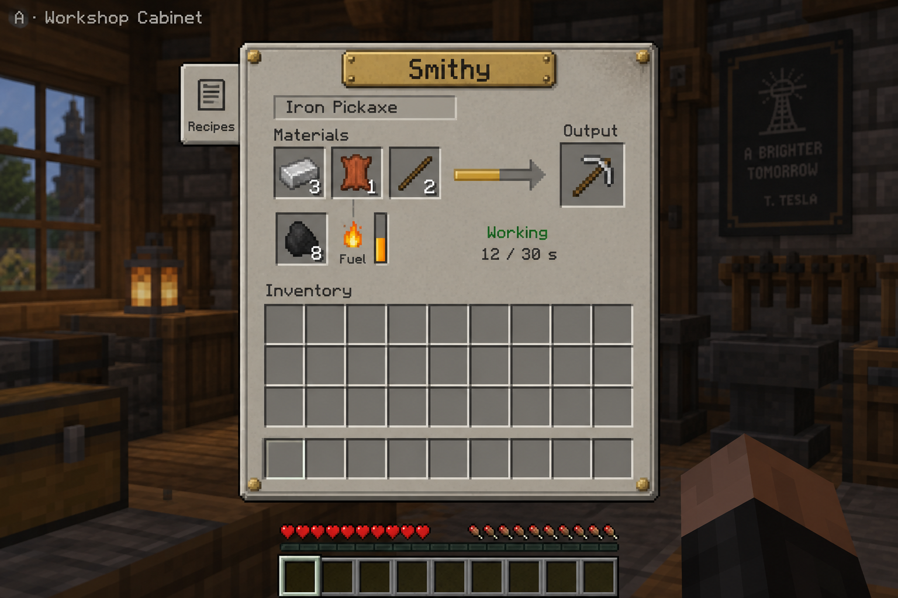
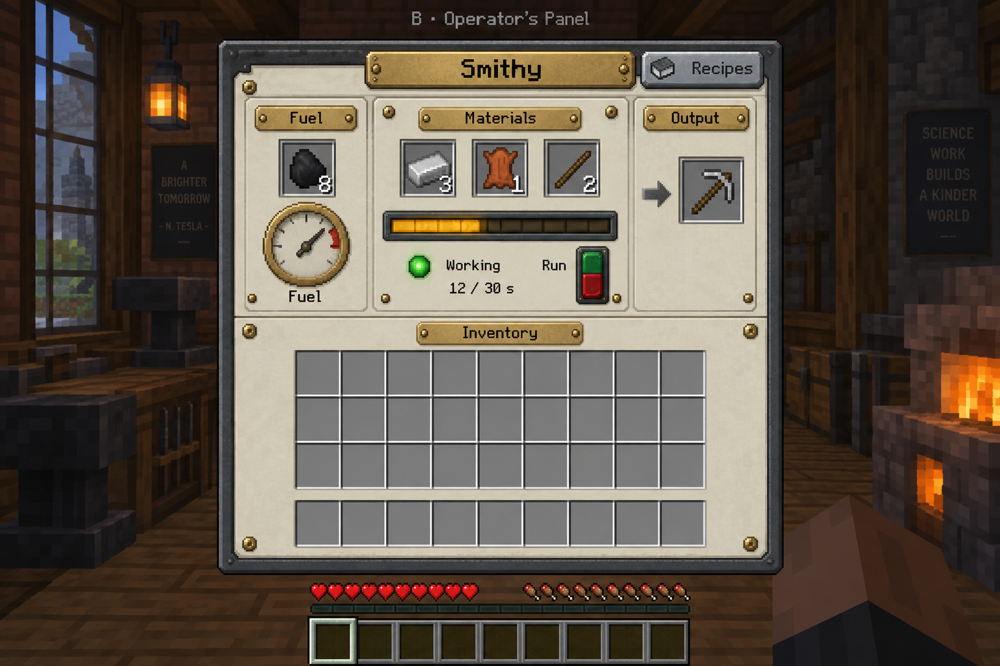
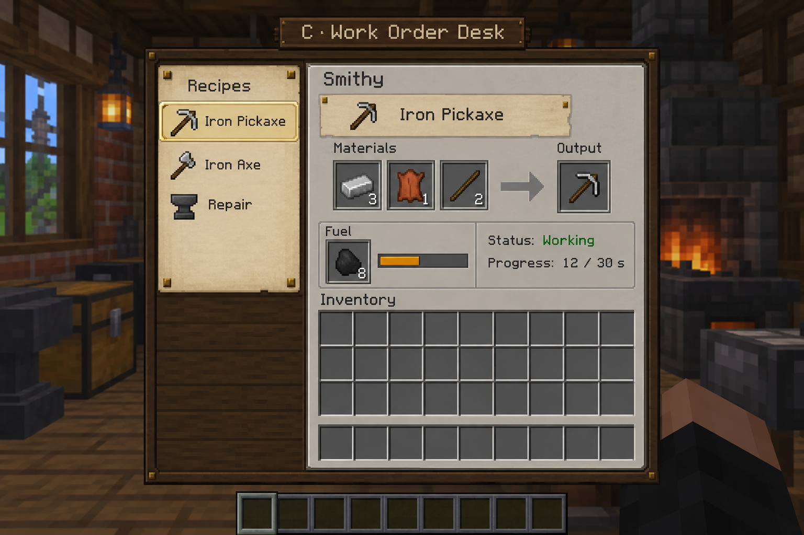
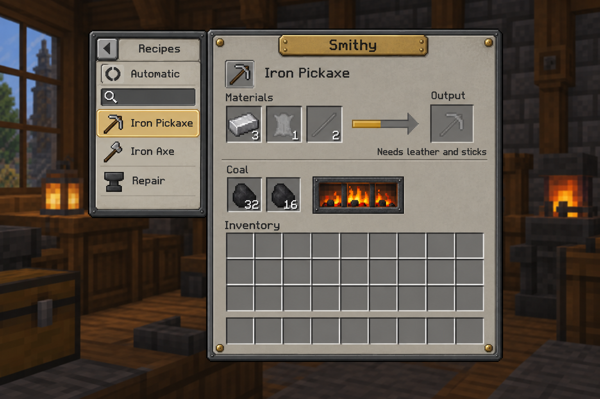
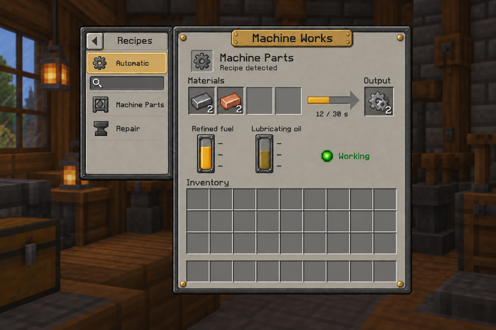

# Civilization concept art

## 06 — The great transmission

Image: [06_the_great_transmission.png](06_the_great_transmission.png). Fresh generation with the built-in image tool, without reference images. A smaller, higher sky civilization, one bottom-center transmitter, one unified tower with a topmost Tesla-inspired receiver, and a thick beam in an epic, almost frightening storm. This is the latest visual direction.

Final prompt:

Use case: stylized-concept. Create a completely NEW cinematic concept artwork for a Minecraft civilization server. Landscape composition, dramatic low viewpoint from a river valley looking toward an immense solitary tower and a small distant sky civilization very high above it. Epic, sublime, almost frightening activation of engineered weather power.

Composition is essential: the sky civilization is a compact floating architectural enclave, fully inside the frame, only about one fifth of the image width, high near the top of the image above storm clouds. It is MUCH higher than the receiving tower with a vast visible gulf of atmosphere between them. Not an enormous city filling the sky. Its ivory stone and aged copper buildings sit on one compact engineered platform. Exactly ONE great transmission machine is built into the BOTTOM MIDDLE of this platform, centered beneath the entire sky city: huge concentric copper coils and gimballed rings around a luminous downward-pointing core, visible from below. This is the only emitter.

On the ground is ONE unified majestic tower: a continuous elegant tapering stone and copper shaft rising from a single substantial foundation to one crown, coherent vertical silhouette, no clustered spires, subsidiary towers, castle complex or side receivers. Monumental Art Deco vertical ribs and Minecraft stepped masonry. At the very TOP of this tower, terminating its shaft, is a massive Tesla-inspired receiver: a series of horizontal copper toroidal rings and ceramic insulators around one terminal. The beam terminates exactly at this topmost receiver, never at the side or midway up the shaft.

One THICK, MAJESTIC blue-white energy beam connects the sky city's bottom-center machine to the tower's TOP receiver across the enormous empty distance. A substantial pillar of blazing energy with a brilliant white core and blue luminous outer envelope, not a thin laser. Slight diagonal is fine for readable composition. The beam's width is a substantial fraction of the receiver's width. It lights the underside of the clouds and washes tower stone and landscape in eerie electric light. Restrained branching corona only around the two terminals, not extra beams. Power has immense terrifying weight and scale, a civilization commanding the heavens. Nearby cloud banks boil with cold light, rain curtains sweep river fields. Tiny warm farmhouse and industrial town windows at the base convey human vulnerability and tower scale, while river and fields reflect the light.

Style: recognizably Minecraft voxel/block-built architecture and terrain with highly crafted cinematic concept art lighting, monumental but plausible block silhouettes. Twilight storm palette, blue-black clouds, copper and ivory architecture, amber settlement lights, intense pale blue energy. Epic almost scary atmosphere, not a cozy golden sunset. Still useful controlled power bringing rain, no destruction or explosion. No text, labels, UI, watermark, pyramids, spaceships, multiple sky cities, multiple towers, thin laser, beam landing on tower's side.


## 05 revision 2 — The great transmitter and regional tower

Image: [05_sky_power_and_rain-v2.png](05_sky_power_and_rain-v2.png). Edited with the built-in image tool using `05_sky_power_and_rain.png` as the reference. Supersedes the earlier architectural treatment: a majestic regional tower receives power from one great central sky machine, directed to one tower at a time. Concept art, not implemented mechanics.

Final edit prompt:

Use case: precise-object-edit / stylized-concept. Edit the attached Minecraft civilization concept artwork to implement TWO major architectural changes. Preserve the warm golden-hour Minecraft voxel/block-built style, inhabited river valley, foreground farmer's porch, farms, river steam cargo boat, industrial town, copper/ivory/turquoise palette, rain over selected fields and immense engineered floating sky civilization. Recompose slightly or widen framing if needed to clearly show both architectural focal points.

CHANGE 1: Replace the rather short domed ground observatory on the right with a truly MAJESTIC HUGE TOWER. A soaring, slender but substantial monumental Art Deco stone-and-copper spire, many times taller than the surrounding town, reaching from a powerful terraced foundation in the valley nearly up to the cloud bank/sky civilization height. Strong vertical ribs, great buttresses, repeated tall arches, tiers of galleries, soaring ivory/aged stone shaft, oxidized turquoise copper details. Its crown is an immense engineered receiving antenna of stepped brass-and-copper rings and ceramic insulators, not a generic tiny church spire. It is a landmark visible across a whole region; make its scale unmistakable using tiny nearby buildings and farmland. No squat domed observatory. Keep fields and river visible below its base.

CHANGE 2: Replace the sky estate's small underside emitter with ONE GREAT CENTRAL MACHINE, an awe-inspiring exposed steerable power transmitter that is clearly the centerpiece of the sky civilization. One colossal gimballed ring-and-coil apparatus in an open monumental cradle at the edge/underside of the floating city, with nested stepped copper rings, thick structural supports, ceramic insulators and one luminous directional core. Make it much larger and more mechanically readable than the original small hanging coil. Palace architecture and service terraces surround and support this machine. Its visible aiming axis points precisely toward the ground tower's receiving crown. It directs EXACTLY ONE controlled narrow blue-white energy beam to EXACTLY ONE receiving tower at a time. No branching rays, no additional emitters, no second active tower, no diffuse blanket broadcast. Both ends of this single beam must visibly connect to the two machines.

The powered tower brings a localized curtain of rain onto nearby river farmland, while foreground and portions of valley stay sunlit. Magnificent useful civic engineering, not a weapon. Strong Minecraft cubic blocks and stepped silhouettes throughout, cinematic atmospheric depth, highly crafted epic architecture. Avoid pyramids, sci-fi spaceships, futuristic holograms, UI, labels, text, watermark, destructive lightning, windmills, waterwheels or solar panels. Keep image landscape, one coherent scene.


## 05 — Sky power and rain

Image: [05_sky_power_and_rain.png](05_sky_power_and_rain.png). Generated with the built-in image tool. Fictional Minecraft concept art: a sky transmitter supplies a ground observatory that brings rain to river farmland. The image depicts the new sky-to-ground power direction, not implemented mechanics.

Final prompt:

Use case: stylized-concept. Asset type: a single spectacular landscape concept artwork for our Minecraft civilization MMO, wide cinematic composition.
Scene: a continuous inhabited river valley seen from a farmer's hillside, looking upward to an immense engineered floating sky estate. The dominant visual story is SKY TRANSMITTER → GROUND OBSERVATORY → AGRICULTURAL RAIN. Show both ends of one clearly legible, thin brilliant blue-white energy beam: a great brass-and-copper transmitter on the underside/edge of the elevated sky institution, and the receiving crown of a separate grounded regional observatory in the valley. Beam crosses open air diagonally, actually terminates in the receiver, not in a field. The receiver's concentric stepped copper rings and ceramic insulators glow with received power. Beneath and beyond this tower a localized cloud bank sheds a delicate visible curtain of rain over golden fields beside a winding river. Other parts of the valley remain warmly sunlit. Electricity is controlled engineered infrastructure, not an attack.
Style: unmistakable Minecraft cubic blocks, stepped voxel architecture, block-built trees and terrain, cinematic painterly concept art, extraordinary monumental scale but strongly legible block construction. Original Tesla-inspired mercantile Art Deco fantasy. Sky architecture is ivory stone, oxidized turquoise copper roofs, terraces, gardens, grand colonnades; its engineered underside exposes dark structural ribs, copper machinery and a modest freight landing with fuel stores. No generic floating dirt island. Ground observatory is an imposing stone-and-copper civic landmark, not a pyramid. Foreground: intimate timber farmhouse porch, tiny blocky farmer, crop rows and lush riverbank; midground painted warehouses, brick industrial town and a small steam cargo boat on the river; one elegant distant airship near the sky estate for scale, subordinate to the power link.
Lighting: late afternoon golden light, amber windows, blue-green copper, soft mist and volumetric rain, restrained electric bloom preserving architectural detail. Feeling: prosperous inhabited countryside connected to awe-inspiring elite engineering, wonder and calm, immense depth. One coherent scene, not a diagram, collage or split panel. No text, captions, UI, logos or watermark. No solar panels, waterwheels, wind turbines, pyramids, destructive lightning, weapons, science-fiction spacecraft or holograms.


Generated using the built-in image generation tool. Exploratory visual concepts, not screenshots or implemented mod features.

Selected images: `01_vertical_civilization.png`, `02_farmland_and_frontier.png`, `03_industrial_city_great_works.png`, `04_sky_weather_observatory.png`.

## Original prompt set

### 01_vertical_civilization

Use case: stylized-concept. Asset type: cohesive Minecraft MMO world concept art, landscape 16:9. Style: spectacular cinematic Minecraft voxel architecture, unmistakable cubic terrain and block-built structures at enormous scale, sophisticated atmospheric lighting and painterly concept-art finish, not photorealistic smooth architecture. World art direction: mercantile industrial civilization with Art Deco verticality, weathered brick and dark iron below, copper/brass machinery, ivory stone and oxidized turquoise copper above, warm amber inhabited windows. BioShock/Infinite-inspired contrast of productive earth and awe-inspiring elite sky institutions, but original world and architecture, no existing characters or logos. Physically legible supply chains, finite mined fuel, no wind turbines, waterwheel power, solar panels, biomass generators, magical resource creation. No text, labels, UI, watermark, collage, or borders. People are tiny blocky figures for scale. Primary request: The whole civilization in one breathtaking panoramic establishing view, from a near hillside looking across a vast inhabited river valley and upward to elite floating districts. Foreground small homesteads and terraced golden farms next to wild forest; exposed stepped mineral quarry and mine entrances feed freight routes; middle distance a dense grand industrial river city with foundries, monumental bridges under construction, tall civic towers, docks and stockyards; high above and clearly physically separated, enormous ivory-and-copper sky estates with gardens and an atmospheric observatory. Massive lift terminals and cargo routes visually connect ground and sky. Controlled rain falls over one distant farming district beneath the observatory while warm late-afternoon sun lights the sky city. Make the image one coherent continuous landscape with strong depth, readable hierarchy, awe, and ambitious yet block-buildable architecture. Sky structures have designed engineered undersides, not generic floating dirt islands.

### 02_farmland_and_frontier

Use case: stylized-concept. Asset type: cohesive Minecraft MMO world concept art, landscape 16:9. Style: spectacular cinematic Minecraft voxel architecture, unmistakable cubic terrain and block-built structures at enormous scale, sophisticated atmospheric lighting and painterly concept-art finish, not photorealistic smooth architecture. World art direction: mercantile industrial civilization with Art Deco verticality, weathered brick and dark iron below, copper/brass machinery, ivory stone and oxidized turquoise copper above, warm amber inhabited windows. BioShock/Infinite-inspired contrast of productive earth and awe-inspiring elite sky institutions, but original world and architecture, no existing characters or logos. Physically legible supply chains, finite mined fuel, no wind turbines, waterwheel power, solar panels, biomass generators, magical resource creation. No text, labels, UI, watermark, collage, or borders. People are tiny blocky figures for scale. Primary request: Ground-level countryside and extraction frontier, a cinematic expansive view from a small farmer's yard toward a commercial agricultural estate and stepped mountain mine. Foreground modest block-built farmhouse, vegetable garden, sacks of provisions, a player harvesting. Midground large patterned grain fields, sturdy barns, grain storehouses, a busy provision-loading yard and freight canal. To the side a terraced mineral quarry, loaded ore wagons and rugged mining settlement, geographically coherent and distinct from farmland. Rain is arriving across selected distant fields while sun still lights foreground. Very high in the distance, tiny yet unmistakable ivory sky palaces establish aspiration and enormous scale contrast; farming and frontier dominate the frame. Make rural work feel prosperous, tangible and inhabited, not miserable or an empty decorative landscape.

### 03_industrial_city_great_works

Use case: stylized-concept. Asset type: cohesive Minecraft MMO world concept art, landscape 16:9. Style: spectacular cinematic Minecraft voxel architecture, unmistakable cubic terrain and block-built structures at enormous scale, sophisticated atmospheric lighting and painterly concept-art finish, not photorealistic smooth architecture. World art direction: mercantile industrial civilization with Art Deco verticality, weathered brick and dark iron below, copper/brass machinery, ivory stone and oxidized turquoise copper above, warm amber inhabited windows. BioShock/Infinite-inspired contrast of productive earth and awe-inspiring elite sky institutions, but original world and architecture, no existing characters or logos. Physically legible supply chains, finite mined fuel, no wind turbines, waterwheel power, solar panels, biomass generators, magical resource creation. No text, labels, UI, watermark, collage, or borders. People are tiny blocky figures for scale. Primary request: Monumental industrial city and great works, cinematic elevated street-to-river view. A dense block-built river metropolis, dark brick factories, copper pipes, grand Art Deco company headquarters, market warehouses and inhabited terraces. Central focal point: an immense half-completed stone-and-steel viaduct crossing the river, with a colossal gantry assembling its next section from clearly visible supplied block pallets; show completed arches, unfinished supports and modest cranes for comparison. Bulk freight barges, ore stockpiles, rail sidings and a towering sky cargo terminal connect the productive city. Upward perspective catches a distant floating elite district through industrial haze. Warm dusk windows, glowing foundry furnaces, blue-gray masonry; powerful, beautiful, smoky, busy. The industrial construction equipment must appear much larger than player tools but materially supplied, not a glowing magic beam or futuristic spaceship.

### 04_sky_weather_observatory

Use case: stylized-concept. Asset type: cohesive Minecraft MMO world concept art, landscape 16:9. Style: spectacular cinematic Minecraft voxel architecture, unmistakable cubic terrain and block-built structures at enormous scale, sophisticated atmospheric lighting and painterly concept-art finish, not photorealistic smooth architecture. World art direction: mercantile industrial civilization with Art Deco verticality, weathered brick and dark iron below, copper/brass machinery, ivory stone and oxidized turquoise copper above, warm amber inhabited windows. BioShock/Infinite-inspired contrast of productive earth and awe-inspiring elite sky institutions, but original world and architecture, no existing characters or logos. Physically legible supply chains, finite mined fuel, no wind turbines, waterwheel power, solar panels, biomass generators, magical resource creation. No text, labels, UI, watermark, collage, or borders. People are tiny blocky figures for scale. Primary request: The apex of civilization, an awe-inspiring elite sky weather observatory and estate, seen from a broad private garden terrace overlooking the earth far below. Luxurious but block-built ivory colonnades, oxidized turquoise copper roofs, monumental stepped Art Deco towers, reflecting pools and formal gardens. Main focal point is a huge engineered brass-and-copper atmospheric instrument with concentric block-built rings and antenna structures crowning the observatory, visibly directing a bounded curtain of rain over distant farmland below while surrounding valley remains sunlit. In a cutaway-like open architectural underside or adjacent lower service terrace, show fuel storage, pipes, heavy machinery and a cargo lift dock receiving material crates; integrate naturally into architecture, not a diagram. A few tiny elegantly dressed blocky inhabitants look down over the landscape. Civilization-scale reach and exclusive calm supported by enormous machinery. Clear bright sky above clouds, warm sunlight, extraordinary scale, readable ground agriculture far below. No lightning weapon, combat, holographic UI, modern aircraft or generic floating islands.

## Continuation prompts and farmland correction

### 03_industrial_city_great_works

Use case: stylized-concept. Create one landscape 16:9 cinematic concept artwork for a Minecraft MMO civilization, unmistakable cubic Minecraft blocks and stepped voxel construction at colossal scale, detailed cinematic atmospheric lighting. Shared world style: weathered brick, dark iron, brass machinery below; ivory stone, oxidized turquoise copper roofs and monumental Art Deco vertical architecture above. Warm amber windows. Original BioShock/Infinite-inspired mercantile industrial world. No text, UI, watermark, borders, collage. No renewable generators, waterwheels, wind turbines, solar panels or biomass power. Tiny blocky players for scale. Finite mined fuel and physical material supply underpin everything. View from an elevated city street toward an immense half-built viaduct crossing a river. Dense industrial metropolis, factories, smokestacks, grand company towers, inhabited terraces, warehouses, ore rail sidings and loaded freight barges. Main focal point is a colossal construction gantry assembling the next span from visible supplied block pallets: completed arches, unfinished supports and much smaller workers establish scale. A towering cargo lift connects to distant floating elite estates glimpsed above the city through haze. Dusk, glowing foundries, blue-gray masonry and amber windows. Show the ability to manipulate enormous quantities of matter, materially supplied machinery rather than magic beams. Grand beautiful busy urban setting, readable composition.

### 04_sky_weather_observatory

Use case: stylized-concept. Create one landscape 16:9 cinematic concept artwork for a Minecraft MMO civilization, unmistakable cubic Minecraft blocks and stepped voxel construction at colossal scale, detailed cinematic atmospheric lighting. Shared world style: weathered brick, dark iron, brass machinery below; ivory stone, oxidized turquoise copper roofs and monumental Art Deco vertical architecture above. Warm amber windows. Original BioShock/Infinite-inspired mercantile industrial world. No text, UI, watermark, borders, collage. No renewable generators, waterwheels, wind turbines, solar panels or biomass power. Tiny blocky players for scale. Finite mined fuel and physical material supply underpin everything. View from a broad elite private garden terrace in the sky down toward the inhabited valley far below. Main focus an awe-inspiring weather observatory: huge concentric brass-and-copper instrument rings, stepped ivory Art Deco towers, turquoise copper domes, reflecting pools, colonnades, formal gardens. A bounded curtain of rain falls over one district of farmland below while surrounding farmland stays sunlit, visually suggesting regional weather control. A naturally visible lower service terrace houses fuel stores, pipes, machinery and a cargo lift receiving crates from below; no diagram cutaway. A few elegantly dressed tiny blocky residents look over the world. Engineered floating structural undersides, not dirt islands. Exclusive calm and luxury powered by enormous machinery. Bright warm sun above clouds, sweeping depth and stunning views. Strong Minecraft block geometry, including the ring instrument made from stepped blocks. No lightning weapon, combat, aircraft, holographic UI.

### 02_farmland_and_frontier

Edit this Minecraft civilization concept image. Change only the large waterwheel near the center of the image at the canal-side mill, and its immediate mounting: remove the wheel completely and replace it with a stationary rectangular brick loading warehouse facade with a dark loading doorway and a small iron cargo crane. There must be no waterwheel or renewable power equipment. Preserve the rest of the entire image, its composition, farming foreground, quarry right, sky estates left, block style, lighting, rain, characters and aspect ratio exactly. No added text.

Reference: C:\Users\admin\.codex\generated_images\01a08a58-4280-7292-9a4b-a14f940d3cfc\exec-1f457aeb-6ccf-42ca-bd46-ad520b09fad4.png


## Machine UI alternatives — 2026-09-12

Generated with the built-in image-generation tool. Unapproved interface concepts, not implemented UI or production textures. All three depict the same Smithy job for comparison. Final inventory dimensions, slot counts, interaction targets and typography must follow actual Minecraft container rules; generated mockups are visual direction rather than exact layout specifications. Background posters/text are incidental generated decoration, not setting canon or historical quotations.

### 07_ui_workshop_cabinet



Prompt:

```text
Use case: ui-mockup. Generate a polished concept mockup for a real Minecraft Java mod machine inventory GUI, flat orthographic pixel-art UI, presented as an in-game screenshot. Wide landscape image, large sharp readable GUI centered, faint dim Minecraft brick-and-timber workshop behind. This is a plausible buildable Minecraft container screen, not a painting of a physical machine. Crisp square pixels and pixel font consistent with high quality Faithful 32x Minecraft, no smooth photorealistic ornamental UI. The setting draws from Nikola Tesla's lifetime: Victorian workshops through early twentieth century electrical apparatus. Restrained and legible, not generic steampunk gear clutter.
All concepts share this exact task: Smithy making an Iron Pickaxe. Three recessed native Minecraft item slots showing 3 iron ingots, 1 leather, 2 sticks; left-to-right progress toward one iron pickaxe in a separated output slot. One real coal fuel slot with 8 coal and a fuel reserve indicator. Status is "Working" and job progress is "12 / 30 s". Inventory below must be exactly three rows of nine equal square slots, plus a separated hotbar row of nine, normal Minecraft slot bevels, predominantly empty. Show the machine title "Smithy", selected job "Iron Pickaxe", labels "Materials", "Output", "Inventory". One small clearly labeled Recipes tab affords recipe selection. No start confirmation, no extra operating tasks, no invented pressure mechanic, no decorative gauges that imply nonexistent systems. Use only these concise readable English labels. Leave plenty of clean breathing room. Distinct finished visual direction: A — WORKSHOP CABINET. Closest to Minecraft's native furnace/chest UI. Pale warm gray zinc panels with classic pixel beveled edges, subtle muted brass corner fasteners, dark lettering. Compact unified rectangular panel. Materials form a horizontal row in the upper middle, classic pixel arrow with an amber filling portion points to the larger output recess at right. Coal sits below the materials on left with a small native flame icon and slender vertical amber fuel reserve bar marked "Fuel". Header resembles a little modest brass maker plate; narrow Recipes tab is attached to the left edge. Strong readability and spacious standard slots, minimal ornaments. Gray native Minecraft foundation with tasteful period craft character. Small concept label above screen: "A · Workshop Cabinet".
```

### 08_ui_operators_panel



Prompt:

```text
Use case: ui-mockup. Generate a polished concept mockup for a real Minecraft Java mod machine inventory GUI, flat orthographic pixel-art UI, presented as an in-game screenshot. Wide landscape image, large sharp readable GUI centered, faint dim Minecraft brick-and-timber workshop behind. This is a plausible buildable Minecraft container screen, not a painting of a physical machine. Crisp square pixels and pixel font consistent with high quality Faithful 32x Minecraft, no smooth photorealistic ornamental UI. The setting draws from Nikola Tesla's lifetime: Victorian workshops through early twentieth century electrical apparatus. Restrained and legible, not generic steampunk gear clutter.
All concepts share this exact task: Smithy making an Iron Pickaxe. Three recessed native Minecraft item slots showing 3 iron ingots, 1 leather, 2 sticks; left-to-right progress toward one iron pickaxe in a separated output slot. One real coal fuel slot with 8 coal and a fuel reserve indicator. Status is "Working" and job progress is "12 / 30 s". Inventory below must be exactly three rows of nine equal square slots, plus a separated hotbar row of nine, normal Minecraft slot bevels, predominantly empty. Show the machine title "Smithy", selected job "Iron Pickaxe", labels "Materials", "Output", "Inventory". One small clearly labeled Recipes tab affords recipe selection. No start confirmation, no extra operating tasks, no invented pressure mechanic, no decorative gauges that imply nonexistent systems. Use only these concise readable English labels. Leave plenty of clean breathing room. Distinct finished visual direction: B — OPERATOR'S PANEL. A late nineteenth / early twentieth century electrical switchboard interpreted with Minecraft pixel art. Ivory enamel work surface, charcoal steel border, very restrained brushed brass rails and screws, black pixel labels. Functionally modular upper half: small left fuel compartment with coal slot and ONE brass-rimmed analog dial labeled "Fuel", center Materials compartment with the three ingredient slots and a horizontal amber work-progress window, right Output compartment. A tiny green glass status lamp next to "Working" and a red/green rocker labeled "Run" are the sole operating control (a proposed pause/resume control). Dial represents stored fuel energy, NOT pressure. Each section is part of one cohesive machine cabinet, no detached HUD cards. A sober 1890s laboratory instrument, no Tesla coils inside the menu. Bottom player's inventory uses normal gray native slot interiors in an ivory panel, exactly vanilla spacing. Small concept label above screen: "B · Operator's Panel".
```

### 09_ui_work_order_desk



Prompt:

```text
Use case: ui-mockup. Generate a polished concept mockup for a real Minecraft Java mod machine inventory GUI, flat orthographic pixel-art UI, presented as an in-game screenshot. Wide landscape image, large sharp readable GUI centered, faint dim Minecraft brick-and-timber workshop behind. This is a plausible buildable Minecraft container screen, not a painting of a physical machine. Crisp square pixels and pixel font consistent with high quality Faithful 32x Minecraft, no smooth photorealistic ornamental UI. The setting draws from Nikola Tesla's lifetime: Victorian workshops through early twentieth century electrical apparatus. Restrained and legible, not generic steampunk gear clutter.
All concepts share this exact task: Smithy making an Iron Pickaxe. Three recessed native Minecraft item slots showing 3 iron ingots, 1 leather, 2 sticks; left-to-right progress toward one iron pickaxe in a separated output slot. One real coal fuel slot with 8 coal and a fuel reserve indicator. Status is "Working" and job progress is "12 / 30 s". Inventory below must be exactly three rows of nine equal square slots, plus a separated hotbar row of nine, normal Minecraft slot bevels, predominantly empty. Show the machine title "Smithy", selected job "Iron Pickaxe", labels "Materials", "Output", "Inventory". One small clearly labeled Recipes tab affords recipe selection. No start confirmation, no extra operating tasks, no invented pressure mechanic, no decorative gauges that imply nonexistent systems. Use only these concise readable English labels. Leave plenty of clean breathing room. Distinct finished visual direction: C — WORK ORDER DESK. A late nineteenth century craft workshop's job ledger integrated into an ordinary Minecraft container menu. Asymmetric yet clear: narrow left attached parchment recipe list with small item icons and only three legible entries "Iron Pickaxe", "Iron Axe", "Repair"; Iron Pickaxe is highlighted. Main light warm gray workspace to right contains a modest paper job card titled Iron Pickaxe above the ingredient slots, native progress arrow and output. Fuel coal slot and a small amber horizontal fuel bar remain in a distinct lower-left compartment of the main panel. Thin dark oak frame, very restrained brass clips, cream paper used only for recipe selection and job heading, not for the native inventory grid. Player inventory spans the lower main body with clear dark recessed slots, perfectly normal chest mechanics. Paper is clean and flat, no cursive, no curly pages, no wax seals, no ornate book illustration. Design conveys a tradesperson choosing a commission while retaining machine efficiency. Small concept label above screen: "C · Work Order Desk".
```


## Unified workshop UI refinement — 2026-09-12

Image: [10_ui_unified_workshop.png](10_ui_unified_workshop.png). Built-in image-generation edit using [Operator's Panel](08_ui_operators_panel.png) for materials/instruments and [Work Order Desk](09_ui_work_order_desk.png) for recipe browsing. The user requested a refined mockup based on the synthesis recommendation. This is a visual proposal, not approval to implement a layout or change processing behavior. It reduces ornament, removes the Run switch, uses one clear process flow and shows an open collapsible/searchable recipe drawer. Final slot sizes and compact GUI scaling still require a deterministic layout pass.

Final prompt:

```text
Use case: ui-mockup. Create one improved Minecraft machine GUI concept screenshot, synthesizing the supplied references. Reference 1 (Operator's Panel) supplies ivory enamel, charcoal metal, restrained brass and real instruments. Reference 2 (Work Order Desk) supplies ONLY a collapsible recipe drawer. Redesign layout and ornamentation for clearer hierarchy, compactness and usability. This is a new proposed interface, not implemented gameplay.

Large, sharp, flat orthographic pixel-art container GUI centered on a dim Minecraft brick and timber workshop background, wide landscape composition. Faithful 32x-compatible Minecraft pixel-art sensibility, square pixel font, clean pixel edges, no photorealistic panel rendering. Keep the background subdued and omit all posters, slogans, historical quotations and extraneous HUD.

Main panel: slim charcoal metal frame, warm ivory enamel face, only four small brass corner screws. One modest brass header strip reads "Smithy"; no other brass label plates. Everything else uses direct dark text on enamel. Native recessed gray Minecraft inventory slots, same size throughout, slot frames simple and consistent.
Top process area: selected recipe "Iron Pickaxe" with a small icon. Directly below, label "Materials" above three equal slots: iron ingots count 3, leather count 1, sticks count 2. To their right a familiar horizontal Minecraft arrow filled 40 percent amber points to ONE equal-sized output slot containing a subtly faded ghost iron pickaxe; above it "Output". Under the arrow exactly "12 / 30 s". Arrange inputs → progress → output clearly on one row.
Below the process, one slim supporting row: label "Fuel", one coal slot containing 8 coal, ONE small simple brass-rimmed analog fuel gauge beside it, and at right a tiny green glass indicator beside "Working". Gauge measures actual remaining fuel energy, not pressure. No extra buttons, run switch, start step, duplicate progress bars, unnecessary divisions, fake controls or lubricant for this smithy.
Bottom half: label "Inventory", exactly THREE rows of NINE identical square empty native slots, plus a separated hotbar of NINE identical empty slots. This grid must retain normal Minecraft proportions and occupy the main body width. Modest breathing space; no oversized title, no huge meter, no wasted tall blank areas.

Attach an OPEN, narrower collapsible recipe drawer to the LEFT of the main panel, aligned at its top, shorter than the full panel so it ends just above the player's inventory. It has the same charcoal frame and a clean cream paper list surface, a compact "Recipes" header with a small left-chevron collapse tab, a small search field with magnifying-glass icon, and three compact rows with item icons: "Iron Pickaxe" highlighted in pale amber, "Iron Axe", "Repair". No giant ledger, no permanent full-height side column, no wood frame, no curly paper. Recipe drawer reads as an optional attachment, not another required machine.
The final result should feel like a functional turn-of-the-century workshop instrument that Minecraft players immediately know how to use. Clarity before ornament, crisp legible labels, simple realistic implementable components. No outer concept title, no explanatory diagram text, no watermark.
```


## Coal and liquid-fuel UI variants — 2026-09-12

User-directed refinement of the shared interface: softer tan surface, two coal slots, a fire indicator instead of a coal dial, optional recipe guidance and automatic ingredient recognition. Generated using the built-in image tool with [A's palette](07_ui_workshop_cabinet.png) and [the unified layout](10_ui_unified_workshop.png) as references. These are concept mockups, not runtime screenshots. The Machine Works recipe/time illustrate a future interface only and do not approve a new machine or alter current Machine Parts production. Coal's generated partially filled arrow is incidental, not a decision about retaining progress while inputs are missing; fire/idle semantics remain to be specified.

### 11_ui_coal_machine



Final generation prompt:

```text
Use case: ui-mockup. Produce one revised Minecraft Java machine container GUI concept, using supplied image 1 ONLY as the palette reference and image 2 as the layout/style reference. Keep image 2's slim charcoal frame, small brass Smithy-style nameplate, open short collapsible recipe drawer, clear materials -> arrow -> output flow, bottom native inventory and restrained functional instruments. Change the bright ivory enamel to image 1's softer, slightly darker muted tan / warm mushroom-gray surface; matte low-contrast texture, calm and readable, not bright cream/yellow. Pixel art matching Faithful 32x sensibility, crisp Minecraft pixel font and native recessed slot bevels. Flat GUI, no perspective distortion. Wide landscape screenshot composition; subdued Minecraft brick and timber workshop behind, no background posters, no extraneous HUD, no text outside the GUI.
Exactly 27 player inventory slots in THREE rows of NINE, plus a separated hotbar row of NINE. Real process slots and player slots same size. Clear amber progress arrow, one output slot, only one status message. Ghost ingredient icons in empty input slots are visibly translucent neutral-gray silhouettes with required counts; never look like real inventory. Recipes are optional: top row of the attached recipe drawer reads "Automatic" with a simple clear/auto icon, then a search field and selectable icon rows. No Start/Run switch, no artificial operating chore. No ornamented section nameplates; direct dark labels. Normal horizontal left-to-right readability. COAL VERSION. Title "Smithy". Drawer has "Automatic", highlighted "Iron Pickaxe", then "Iron Axe", "Repair". Main job heading "Iron Pickaxe". Label "Materials" above three input slots: a real stack of 3 iron ingots, translucent ghost leather with small count 1, translucent ghost sticks with small count 2. A dim unfilled arrow points to a faded ghost iron pickaxe beneath "Output". Status text exactly "Needs leather and sticks". This demonstrates choosing a recipe to guide filling inputs. Beneath processing, supporting row labeled "Coal": EXACTLY TWO adjacent normal square fuel slots showing coal stacks counted 32 and 16. To their right replace the round dial completely with a beautifully drawn small rectangular cast-iron furnace fire window: warm orange-red embers, gold pixel flames behind a few simple dark grate bars, looks like a richer native Minecraft furnace flame indicator and would animate in game. Modest size about two inventory slots across and one high; it represents furnace heat, not an extra game control. No analog gauge, no numeric fuel gauge, no liquid tanks anywhere on this coal screen. Retain a soft muted tan surface, sparse brass, charcoal frame and clean optional drawer. Show the whole panel clearly.
```

### 12_ui_liquid_fuel_machine



Final generation prompt:

```text
Use case: ui-mockup. Produce one revised Minecraft Java machine container GUI concept, using supplied image 1 ONLY as the palette reference and image 2 as the layout/style reference. Keep image 2's slim charcoal frame, small brass Smithy-style nameplate, open short collapsible recipe drawer, clear materials -> arrow -> output flow, bottom native inventory and restrained functional instruments. Change the bright ivory enamel to image 1's softer, slightly darker muted tan / warm mushroom-gray surface; matte low-contrast texture, calm and readable, not bright cream/yellow. Pixel art matching Faithful 32x sensibility, crisp Minecraft pixel font and native recessed slot bevels. Flat GUI, no perspective distortion. Wide landscape screenshot composition; subdued Minecraft brick and timber workshop behind, no background posters, no extraneous HUD, no text outside the GUI.
Exactly 27 player inventory slots in THREE rows of NINE, plus a separated hotbar row of NINE. Real process slots and player slots same size. Clear amber progress arrow, one output slot, only one status message. Ghost ingredient icons in empty input slots are visibly translucent neutral-gray silhouettes with required counts; never look like real inventory. Recipes are optional: top row of the attached recipe drawer reads "Automatic" with a simple clear/auto icon, then a search field and selectable icon rows. No Start/Run switch, no artificial operating chore. No ornamented section nameplates; direct dark labels. Normal horizontal left-to-right readability. LIQUID FUEL VERSION. This is a conceptual future oil-powered workshop named "Machine Works", not a specification of an existing recipe. Keep exactly the same visual family and main panel footprint as the coal reference layout. The drawer has "Automatic" highlighted with a subtle amber selection, then "Machine Parts" and "Repair". Main job heading "Machine Parts", with small secondary text "Recipe detected" to illustrate automatic recognition when no recipe is pinned. Materials row contains two actual opaque item stacks: 2 steel ingots (dark steel gray) and 2 copper ingots (orange copper); amber process arrow filled about 40 percent pointing to an output slot with a small mechanical-parts icon counted 2. Beneath the arrow "12 / 30 s". Supporting row below contains compact functional fuel/oil instrumentation in place of the coal fire compartment: TWO narrow vertical glass sight gauges in simple dark-metal/brass frames, one clearly labeled "Refined fuel" containing amber liquid at about 70 percent, one clearly labeled "Lubricating oil" containing olive-brown oil at about 40 percent. Each has three understated tick marks; these are tank-level displays, not inventory slots or pressure dials. Add a tiny green lamp and the one state label "Working" alongside. No coal slots, no fire window, no temperature/pressure gauges, no extra speed/durability bars. Fuel and oil gauges should be compact and subordinate to materials/output, with space for normal readable hover values but do NOT draw a tooltip. Same muted tan background, slim frame, restrained brass and native slot grid. Show the whole panel clearly.
```

Liquid-fuel correction: removed spurious generated ghost ingredients in automatic mode. Edit target was `C:/Users/admin/.codex/generated_images/01a08a58-4280-7292-9a4b-a14f940d3cfc/exec-13e2cd1d-d5c1-4528-89d3-32546d6c2a88.png`; the corrected version is the published concept above.

```text
Edit this exact Minecraft Machine Works GUI mockup. Preserve the entire composition, softer tan palette, text, frame, recipe drawer, real steel ingot count 2, real copper ingot count 2, progress arrow and 12 / 30 s, output, gauges and inventory. Make ONE correction only: in the Materials row, erase the pale ghost gear with count 2 and pale ghost stick with count 4 from the third and fourth slots. Leave those two recessed square slots empty, with plain gray interiors matching the other empty inventory slots. This screen is automatic mode and already has all required materials; therefore there must be exactly two visible ingredient icons (the real steel and copper) and NO ghost ingredient icons or leftover count numbers. No other changes.
```

## Freight boat and bulk storage concepts

Generated with the built-in image tool. Full prompts, source paths and image hashes are recorded in [freight concept receipt](freight_concepts.json). These are visual proposals, not implemented structures or texture assets. Generated text, scale bars and small details are illustrative, not specifications.

- [River freighter](13_river_freighter.png): larger working deck, aft wheelhouse, room for bulk cargo.
- [Coal bunker](14_coal_bunker.png): open top, rising coal mound and accessible transfer port.
- [Liquid cargo tank](15_liquid_cargo_tank.png): horizontal faceted tank, saddle supports and visible level strip.

## Tier 2 kitchen workshop

One coherent workshop direction, generated with the built-in image tool on 2026-09-30: [complete room](../art/assets/t2_kitchen/mockup-04.png) and [four-station sheet](../art/assets/t2_kitchen/mockup-03.png). Preparation bench, cooking range, baking oven and portioning bench are proposed roles for the user's requested multi-multiblock kitchen. The [asset record](../art/assets/t2_kitchen/asset.json) preserves the written brief, exact prompts, inspected reference roles, original generated image paths/hashes and all four iterations; [review](../art/assets/t2_kitchen/review.json) records correction of the inherited anvil emblem and excessive kettle glow. Planning art only: dimensions, recipes, construction, meal bonuses and runtime implementation remain unresolved.

## Oil Engine

The current [refined engine mockup](../art/assets/oil_engine/mockup-05.png) was generated from a new brief, then refined to clear the front service corners and support the flywheel through its shaft instead of its rim. A later referenced edit removes the broad copper support and retains the layered castings and fittings. The [asset record](../art/assets/oil_engine/asset.json) retains exact prompts, originals, reference hashes, failed iterations and model/in-game reviews.

Earlier [A — exposed iron](17_oil_engine_exposed.png) and [B — marine enclosed](18_oil_engine_marine.png) are historical proposals. A was selected, then superseded by the user's request to restart from scratch. [Original receipt](engine_mockups.json). Generated dimensions and perspective remain guidance, not exact build coordinates.

[Hot-bulb engine mockup](16_oil_engine.png), reviewed for a compact steel-bed/iron-casting engine. Exact prompt and subsequent texture prompts/references are in the [source receipt](../art/textures/engine/source-receipt.json). Runtime parts are simplified to Minecraft geometry; concept lettering is not a build specification.

## Helicopter alternatives

Two requested visual proposals: [A — Kestrel utility rotorcraft](helicopters/kestrel.png), an open steel-frame craft with lateral rotors, and [B — Meridian aerial carriage](helicopters/meridian.png), an ivory/turquoise enclosed coaxial craft. [Brief](helicopters/brief.md) and [exact prompts, provenance and visual review](helicopters/receipt.json). These explore personnel/light-cargo transport; no gameplay, recipe, flight physics or vehicle implementation is approved.

## Extraction siege installations

[Coal and oil extraction siege mockups](extraction_sieges/brief.md) explore landmark-scale machines as strategic objectives. Their brief records exact prompts, generated sources, hashes and visual review; they are concepts only.

## Sky access monument concepts

Generated with the built-in image tool on 2026-09-21 as three user-requested competing architectural directions. They are atmosphere and silhouette studies, not selected designs, build coordinates, recipes or implemented transport. Shared constraints: a physically reachable summit, one controlled upward transfer beam, Minecraft-legible construction, Tesla-era materials and a distant compact sky civilization.

### 19 — Ascension Spire

Image: [19_ascension_spire.png](19_ascension_spire.png). SHA-256 `2ce74003973ce3d5683a8610a82493e05f6a866d6f0c9f9510601207bc334ec6`. Source: `C:/Users/admin/.codex/generated_images/01a08a58-4280-7292-9a4b-a14f940d3cfc/exec-aadd9bc8-9442-4d9f-8301-47664cdbcd95.png`.

```text
Use case: stylized-concept. Asset type: architectural concept art for the Civilization Minecraft mod/server. Primary request: THE ASCENSION SPIRE, first of three comparable concepts for a colossal ground gateway that lets players physically climb to a high transfer point and then be beamed into a distant sky civilization. Scene/backdrop: broad inhabited river valley at stormy blue-hour, farms, brick industrial town, river barges and rail infrastructure tiny at the base; a very small compact floating sky civilization is barely visible extremely high above the clouds. Subject: one enormous unified tower, unmistakably block-built and realistically constructible in Minecraft, rising from a broad terraced civic station. Strong single vertical silhouette, pale stone structural ribs, dark steel internal frame, oxidized turquoise copper, brass fittings, porcelain insulator galleries. The lower floors feel like late-19th-century terminal architecture; exposed lift cages, switchback stairs and observation galleries make the physical ascent legible. At the crown is one open circular arrival platform inside a monumental copper toroidal receiver. Tiny blocky players stand on the crown platform. A thick controlled blue-white vertical transfer beam begins around the people and continues upward through the clouds toward the sky civilization. The crown machinery clearly surrounds the destination point without harming occupants. Style/medium: cinematic high-detail Minecraft voxel concept art, sophisticated atmospheric lighting, stepped block geometry, implementable repeated modules and no smooth science-fiction spaceship surfaces. Nikola Tesla lifetime alternate history developing into restrained monumental Art Deco. Composition/framing: wide landscape, dramatic low three-quarter view showing full tower from foundation to crown and enough surrounding town for scale; tower is dominant and entirely inside frame. Lighting/mood: sublime, mysterious and awe-inspiring, almost frightening electrical activation, warm amber inhabited windows against cold blue beam and storm clouds. Materials/textures: pale limestone, dark riveted steel, weathered brick foundations, oxidized copper roofs/conductors, restrained brass instruments, white ceramic insulators, glass observation windows. Constraints: exactly one tower and one upward beam; physically legible path from ground station to crown transfer platform; clear block scale; architecture must fit Civilization's existing Tesla-era material language. Avoid: fantasy wizard tower, generic steampunk gears, modern skyscraper curtain walls, rocket launchpad, elevator cable reaching the sky city, multiple beams, multiple towers, portals floating at ground level, text, labels, UI, watermark, collage.
```

Review: strongest readable ascent and easiest modular Minecraft translation. The central stair/lift void, terminal base and crown remain coherent; no blocking mechanical error.

### 20 — Apogee Pyramid

Image: [20_apogee_pyramid.png](20_apogee_pyramid.png). SHA-256 `f3665efa625f841ec863d9799e12cc1b767ecb1172f141902960eb7f982f1d44`. Source: `C:/Users/admin/.codex/generated_images/01a08a58-4280-7292-9a4b-a14f940d3cfc/exec-22c3c323-ccde-4507-baef-4a3414915e39.png`.

```text
Use case: stylized-concept. Asset type: architectural concept art for the Civilization Minecraft mod/server. Primary request: THE APOGEE PYRAMID, second of three comparable concepts for a colossal ground gateway that lets players physically climb to a high transfer point and then be beamed into a distant sky civilization. Scene/backdrop: broad inhabited river valley at stormy blue-hour, farms, brick industrial town, river barges and rail infrastructure tiny around the monument; a very small compact floating sky civilization is barely visible extremely high above the clouds. Subject: one immense stepped truncated pyramid, unmistakably block-built and realistically constructible in Minecraft, combining ancient monumental mystery with late-19th-century electrical engineering. Broad dark masonry and pale limestone terraces rise through processional ramps, railway-fed service galleries and massive arched machine halls. Copper conductor bands climb the four sloping faces toward a summit. Porcelain insulator pylons, restrained brass instruments and glass transformer chambers reveal that this is a functional Tier-3 energy accumulator, not a tomb. Players physically ascend exterior ramps and interior galleries to a small ceremonial summit platform. At the exact apex is a deep circular copper-and-ivory transit crown surrounding the people. One thick controlled blue-white beam rises vertically from the apex through the clouds toward the sky civilization. Style/medium: cinematic high-detail Minecraft voxel concept art, sophisticated atmospheric lighting, stepped block geometry and implementable repeated modules; Nikola Tesla lifetime alternate history evolving toward restrained monumental Art Deco. Composition/framing: wide landscape, low three-quarter view showing the complete pyramid from huge foundation to summit and enough surrounding settlement for scale; pyramid dominant and entirely inside frame. Lighting/mood: ancient, mysterious, solemn and awe-inspiring; the monument feels older than the surrounding city but has been completed or awakened by industrial civilization. Warm amber galleries contrast with cold electrical light and storm. Materials/textures: charcoal basalt lower courses, pale limestone upper ribs, dark riveted steel machine galleries, oxidized copper conductor bands, restrained brass, white ceramic insulators, glass instrument chambers. Constraints: exactly one pyramid and one upward beam; physically legible climb from ground to summit transfer point; clear Minecraft block scale; machinery embedded logically in terraces; no Egyptian decoration or copied real-world pyramid. Avoid: desert setting, pharaoh imagery, smooth alien megastructure, generic magical temple, decorative gears, modern sci-fi portal, multiple beams, multiple pyramids, beam originating inside an inaccessible sealed cap, text, labels, UI, watermark, collage.
```

Review: strongest sense of accumulated resources and mystery, but this first version was rejected as too large and complicated.

Refined image: [20_apogee_pyramid-v2.png](20_apogee_pyramid-v2.png). SHA-256 `c6fa8b1a73b0a5faeca1a0ff5867853e28b59d5ba9c2f219315a7ed62a8533d7`. Source: `C:/Users/admin/.codex/generated_images/01a08a58-4280-7292-9a4b-a14f940d3cfc/exec-ab498422-818c-4a7c-bd4a-f3810d869679.png`.

```text
Use case: precise-object-edit. Asset type: revised architectural concept mockup for the Civilization Minecraft mod/server. Input image: edit target and style/material reference. Primary request: redesign the Apogee Pyramid into a substantially SMALLER, SIMPLER, realistically player-buildable Minecraft multiblock while preserving its core identity and atmosphere. Change the monument itself to approximately 45 blocks wide, 45 blocks deep and 28–32 blocks tall. It should still dominate a town square, but nearby factories, warehouses and houses must look substantial beside it rather than microscopic. Use exactly THREE major stepped tiers above one compact foundation. Remove the sprawling artificial island, enormous retaining walls, multiple railway viaducts, repeated side pyramids, dozens of galleries, excessive arches and forest of insulator towers. Give it one strong symmetrical silhouette: a dark basalt/brick lower foundation, two broad pale-limestone stepped terraces, and one compact flat summit. Use ONE wide central processional staircase from ground to summit, with simple landings at each tier. Add only two modest side service entrances at the base. Four restrained copper conductor channels, one centered on each sloping face, climb visibly toward the summit. Use a small number of large porcelain insulators at tier corners rather than many repeated pylons. At the summit, keep one compact circular copper-and-ivory transfer crown roughly 9–11 blocks across, open to the sky, with a reachable central player platform. Tiny blocky players at the stairs and summit establish scale. Exactly one thick blue-white transfer beam rises from the summit toward the small distant sky civilization. Preserve: stormy blue-hour river-valley setting, Minecraft voxel/block-built geometry, late-19th-century Tesla alternate-history materials, charcoal masonry, pale limestone, dark steel, oxidized copper, restrained brass, warm amber interior light, mysterious awe-inspiring activation. Implementation readability: use large repeated wall modules, straightforward stairs/slabs, broad continuous surfaces and only a few signature machine elements. The design should look achievable by a committed group of Minecraft players, with most of its volume made from ordinary masonry and the expensive electrical pieces concentrated at the summit and four conductor channels. Composition: pull the camera closer to a town-square three-quarter view that clearly shows the entire revised monument and surrounding full-sized buildings for scale. Avoid: gigantic regional megastructure, ziggurat with more than three main tiers, intricate maze of galleries, huge railway complex, auxiliary pyramids, decorative clutter, Egyptian imagery, magical fantasy temple, modern science-fiction portal, multiple beams, text, labels, UI, watermark. Change the monument and necessary composition only; retain the established visual language and beam destination.
```

Review: the revised silhouette is a credible town-scale great work. Three tiers, a single ascent and four conductor runs are immediately readable; ordinary masonry carries most of the construction cost while the summit crown contains the rare Tier-3 machinery. No blocking visual or structural issue remains for this planning mockup.

The image was subsequently simplified without further image generation into [Apogee Pyramid review schematic v1](schematics/apogee_pyramid_v1/README.md). Its 37×37×23 proportions were rejected as too low and wide. [Review schematic v2](schematics/apogee_pyramid_v2/README.md) tested three taller terraces; [v3](schematics/apogee_pyramid_v3/README.md) tested four. Both still read as ziggurats. [Schematic v4](schematics/apogee_pyramid_v4/README.md) replaces those exterior levels with one continuous 31×31×31 fourfold-symmetric stepped pyramid: identical slopes and copper spines on all four faces, a hollow shell for a future internal ascent with four progression stages, and the retained open 7×7 crown. Its four crown supports sit at diagonal corners directly under the ring, keeping all cardinal stair approaches clear. Every package preserves exact coordinates, vanilla structure NBT, material counts and procedural drawings. Status: the v4 exterior is approved; its stand-in palette, internal route, recipe and gameplay remain unresolved.

### 21 — Resonance Crown

Image: [21_resonance_crown.png](21_resonance_crown.png). SHA-256 `84bda055c458f0741c15fbb3a7f2843c60fc26a773001c7327fe80f51189ba0b`. Source: `C:/Users/admin/.codex/generated_images/01a08a58-4280-7292-9a4b-a14f940d3cfc/exec-d792e9ac-46a6-4b52-b0d4-32664c8ff5c5.png`.

```text
Use case: stylized-concept. Asset type: architectural concept art for the Civilization Minecraft mod/server. Primary request: THE RESONANCE CROWN, third of three comparable concepts for a colossal ground gateway that lets players physically climb to a high transfer point and then be beamed into a distant sky civilization. Scene/backdrop: broad inhabited river valley at stormy blue-hour, farms, brick industrial town, river barges and rail infrastructure tiny beneath the monument; a very small compact floating sky civilization is barely visible extremely high above the clouds. Subject: one colossal open circular electrical observatory built across the crest of a mountain-height artificial stone platform. Two immense pale-stone and dark-steel buttresses support a single upright copper torus/ring hundreds of blocks tall, like a monumental scientific crown rather than a fantasy portal. The center remains open to the sky. A narrow central tower rises only to the ring's midpoint, reached by visible inclined elevators, switchback stairs and galleries from the valley. At its top, suspended exactly in the open center of the great ring, is a small circular transfer dais with tiny blocky players. Radial copper conductor bridges and porcelain insulator chains connect the dais to the ring, making the engineering legible. When activated, restrained corona travels around the ring and exactly one thick controlled blue-white beam lifts vertically from the central dais through the clouds toward the sky civilization. Style/medium: cinematic high-detail Minecraft voxel concept art, sophisticated atmospheric lighting, block-built stepped geometry and implementable repeated structural modules; Nikola Tesla lifetime alternate history evolving into restrained monumental Art Deco. Composition/framing: wide landscape, dramatic three-quarter view showing the entire ring, supporting buttresses, central climb and surrounding river city; ring is dominant and fully inside frame, strong negative space through its center. Lighting/mood: mysterious scientific monument, sublime and almost frightening when energized; cold blue electrical light with warm inhabited galleries and city windows. Materials/textures: pale limestone ribs, dark riveted steel trusses, weathered copper ring, restrained brass contacts, white porcelain insulator chains, glass instruments, brick service halls at the foundation. Constraints: this is architecture and machinery, not a portal surface; exactly one upright ring and one upward beam from a reachable central platform; obvious physical ascent from ground to center; clear Minecraft block scale; no unsupported floating pieces. Avoid: Stargate-like filled portal, fantasy magic circle, generic steampunk gears, Ferris wheel, radio telescope dish, modern sci-fi, multiple rings, multiple beams, floating platform without supports, text, labels, UI, watermark, collage.
```

Review: most distinctive silhouette and strongest visual bridge to the sky civilization. The open ring, supported central dais and radial insulators are mechanically readable; the negative space prevents it from becoming a generic portal wall.
