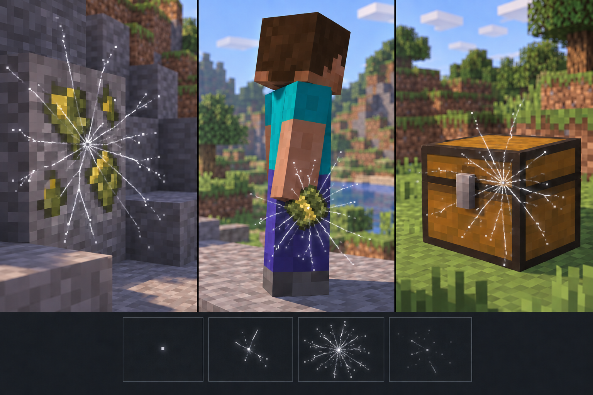

# Uranium radiation particle concept

This concept sheet guided a shared effect for exposed Uranium Ore, uranium held by a player, and chests storing either uranium item. The user-supplied [branching-track reference](user-reference.png) sets the shape: fine, uneven silver-white tracks that sometimes fork, followed by a quiet interval. The reference's photographic full-frame scale is reduced to short local tracks around the Minecraft source. The ore and raw item retain their existing muted olive/ochre sprites from [frontier uranium art](../../art/assets/frontier_uranium/prompts.md). The chest remains a normal chest. The shipped cue adds no radiation damage, storage rule or fuel behavior.

Review: the first generated pass used cyan, lightning-like branches that read as electricity. The first edit corrected the gray-white palette but was too sparse. The second edit brought back the reference's radial density and fine branching. It establishes the **peak-frame style**, not the timing. Its four footer frames looked like a synchronized starburst pulse and were rejected for motion.

The [animated frame study](../../art/assets/uranium_tracks/animation-preview.gif) uses independent streak events instead: each silver-gray head travels most of its path in one frame, completes it in the next, and leaves a stationary trail that fades over several more frames. Direction, start and fade time vary. Each track starts at a randomly selected **exterior edge of its source** and travels outward. The chest in this motion study is a schematic placeholder, not a proposed replacement texture. The first study launched roughly 7.5 streaks per second per source, which was too busy. The revised 12.24-second preview launches 16 per source, averaging **1.3 streaks per second**, with random quiet gaps and occasional close pairs; each trail lasts about 0.7–1.3 seconds. One deterministic [source generator](../../art/assets/uranium_tracks/export.py) produces three seeds with offset phases for ore, carried raw uranium and stored uranium; [consecutive frames](../../art/assets/uranium_tracks/frame-contact.png) allow motion inspection. [The quieter prior version](particle-mockup-v1.png) remains available for comparison.

The implemented [renderer](../../civilization-mod/src/main/java/dev/civilization/client/UraniumRadiation.java) uses this timing and edge-origin rule without shipping the preview frames as textures. It draws procedural lines from exposed ore, held uranium and nearby stocked chests; the server sends only nearby chest positions. After in-game review, the tracks were lengthened from sub-block wisps to **2½–3½ blocks**, with mild directional irregularity and the same sparse launch timing. Both the held-item and fixed-object tracks keep their launch position in world space, so moving a player or removing the source does not drag or erase an existing trail. Per-vertex opacity tapers both tips and the occasional fork. The focused `uranium` visual scene passed under Photon/Faithful at 1920×1080. The [review frame](../../art/assets/uranium_tracks/long-tracks-photon.jpg) shows tracks extending several blocks from the stocked chest and ore; its SHA-256 is `BEFAE6C23CAEF59215FFF09E1B94E7E944AB3E84C63973813F542B961B68495F`. The static screenshots cannot establish the exact perceived animation cadence in normal play; that remains a playtest observation.

The user reference came from `C:/Users/admin/AppData/Local/Temp/codex-clipboard-703e52d9-76a6-4652-91ef-c251e56655d8.png`, SHA-256 `3A95BA0C8B38D140F7CAFCD5F7D8B03B0688CB063197916F22B38EEF69056FC5`. Generated with the built-in image tool on 2026-09-28. First pass: `C:/Users/admin/.codex/generated_images/01a08a58-4280-7292-9a4b-a14f940d3cfc/exec-f1889e25-ad95-4b25-a275-a54e402a7e97.png`, SHA-256 `11482BD56ED478F7880D47E0B052DFC792FB8C386D57FD24C08A9E766225022D`. First referenced edit: `C:/Users/admin/.codex/generated_images/01a08a58-4280-7292-9a4b-a14f940d3cfc/exec-e11259f2-7dde-497b-8763-5833f47308b5.png`, copied to `particle-mockup-v1.png`, SHA-256 `6EDC1D23BE577A8A117F56559817009D580CCC18A01B447F26FD9C17ABAD9F87`. Current edit: `C:/Users/admin/.codex/generated_images/01a08a58-4280-7292-9a4b-a14f940d3cfc/exec-656e1f7b-19ec-4419-8d57-0c0a825b9684.png`, copied to `particle-mockup-v2.png`, SHA-256 `66EC589D11845EE45250BC1FF935B01FC1F5CAFFACE717CDBC181FE5E3BE78F5`.

## Prompts

First pass: “Create one polished visual concept sheet for a shared Minecraft uranium radiation particle animation, not a new item texture. Use the attached reference only for delicate branching ionization tracks, not photographic intensity. Show the same restrained motif at exposed ore, a chunk carried low at a player's side, and a closed chest containing uranium. Existing uranium is olive-green with muted yellow-gold inclusions. Show only a few tiny pale tracks and motes near each source, with a four-frame emerge/fork/fade/quiet strip. Preserve recognizable Minecraft geometry, soft daylight and pixel-aware particles. No lightning, magic aura, green fog, hazard symbol or explosion.”

Selected edit: “Preserve the preceding three-panel sheet and four-frame strip. Change only the bright cyan electrical particle treatment to much subtler radiation tracks: thin, short, irregular frosty off-white lines, an occasional tiny fork and sparse pale motes, almost no cyan. Show at most one short track and one to three motes per source at any instant, with very low opacity and no continuous halo. Localize the chest effect near one small point in its lid seam. Keep the uranium mineral colors, subjects and composition unchanged.”

Current edit: “Use the first edited sheet as the composition target and the user reference as the branching radial-track source. Preserve the three Minecraft subjects and uranium colors. Intensify the shared effect to roughly ten to sixteen very fine, uneven neutral gray-white streaks radiating from a tiny point, with several short forks and bright flecks. Keep the burst local to each source, clearly visible on the chest seam, and avoid all blue/cyan, thick lightning or magical fog. Revise the four footer frames to show point, growing radial tracks, dense peak, then fading quiet.”
